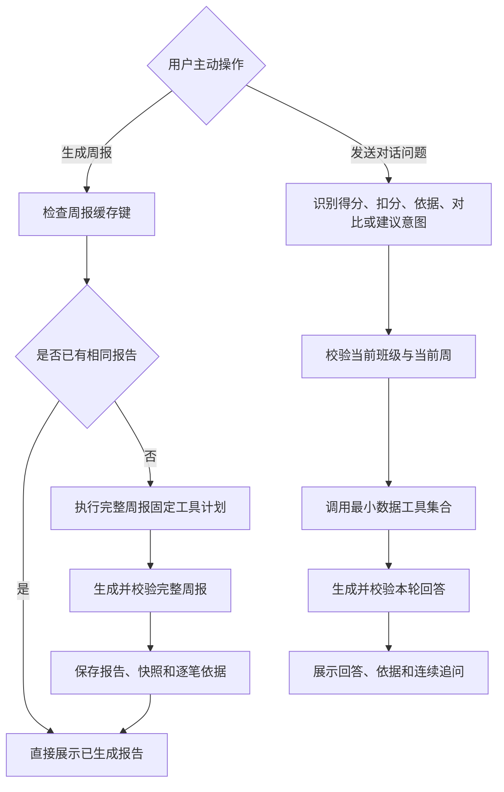

# PRD-班主任助理 V2：班级周评分析 Agent

> 文档版本：V2.3
> 更新日期：2026-08-11
> 适用端：教师手机端
> 当前阶段：Demo 验证完成，待接入真实数据工具和模型
> 文档状态：V2 当前有效需求基线

## 文档关系

本文档取代以下旧方案，旧文件仅保留为历史记录，不再作为 V2 实现依据：

- `docs/PRD-班主任助理V2-班级评价自由对话.md`
- `docs/班主任助理V2_班级评价自由对话_系统提示词.md`

旧方案中的责任划分、整改状态、负责人和申诉处理仍不属于当前 V2。V2.3 在现有完整周报基础上恢复受控自由对话，但只允许查询当前班级评价数据，不恢复旧方案中超出真实数据范围的能力。

当前 Demo 中还没有独立的真实模型提示词调用。代码保存周报和对话提示词版本编号，并用前端领域逻辑模拟结构化结果：

- 完整周报和模拟分析逻辑：`mobile-app/domain/classEvaluationAssistantV2.ts`
- 回答页面：`mobile-app/views/AiHeadteacherAssistantV2View.tsx`

本文档第 7.7 至 7.11 节定义正式接入时使用的提示词、工具、输入和输出协议。

## 1. 摘要

班主任助理 V2 是面向班主任的班级周评分析 Agent。它基于班级每周得分、排名、一级指标得分和逐笔扣分记录，既能生成一份包含整体表现、主要扣分问题、下周关注重点和逐笔依据的完整周报，也能按班主任的具体问题查询数据并连续追问。

完整周报仍由班主任主动点击生成，并执行固定工具计划。自由对话由班主任通过语音或文字主动触发，Agent 根据问题选择当前班级、当前周所需的数据工具。两种能力分别保存状态，不因对话自动生成或改写周报。

## 2. 联系人

| 角色 | 负责人 | 主要职责 |
|---|---|---|
| 产品负责人 | 待补充 | 确认 V2 范围、问题文案和验收口径 |
| 学校德育负责人 | 待补充 | 确认班级评价周期、指标和排名口径 |
| 班主任代表 | 待补充 | 验证统计、分析和建议是否有用 |
| 后端研发 | 待补充 | 提供权限、统计、记录和周对比工具 |
| 人工智能研发 | 待补充 | 实现提示词版本、模型调用和结果校验 |
| 教师端研发 | 待补充 | 实现数据面板、周报生成和历史交互 |
| 测试负责人 | 待补充 | 验证数据一致性、证据引用和异常状态 |

## 3. 背景

### 3.1 用户问题

学校按周对班级进行评比。班主任目前能看到得分，但仍需要自己整理以下信息：

1. 本周整体表现如何，优势项和薄弱项是什么。
2. 扣分主要集中在哪些一级指标和具体场景。
3. 与上一周相比哪些项目发生了变化。
4. 下周应该优先关注什么。
5. 分析结论具体依据哪些扣分记录。

普通数据面板能回答“是多少”，但不能稳定回答“说明了什么”和“下一步看什么”。完全自由的聊天 Agent 又会扩大数据和问答范围，产生无法回答、口径漂移和幻觉风险。

### 3.2 V1 与 V2 的区别

| 项目 | 班主任助理 V1 | 班主任助理 V2 |
|---|---|---|
| 评价对象 | 学生和学生群体 | 班级 |
| 主要数据 | 教师提交的学生评价记录 | 班级周评统计和逐笔扣分记录 |
| 核心任务 | 发现学生、教师评价和班级模式 | 解释班级得分、扣分和周变化 |
| 问题入口 | 两类周期报告任务 | 一个班级周评报告任务 + 受控自由对话 |
| 输出方式 | 固定统计与人工智能洞察 | 固定统计、人工智能分析、建议和依据 |
| 是否自由聊天 | 否 | 是，仅限班级评价数据范围 |

### 3.3 已确认的数据事实

当前系统只录入每个班级的评价情况并进行打分。系统没有责任划分和整改相关数据。

V2 可使用的数据只有：

- 当前评价周期和数据截止时间。
- 本周总分、满分和累计扣分。
- 班级总分的年级排名。
- 每个一级指标的当前分、满分、年级排名和全校排名。
- 每个一级指标的扣分笔数和累计扣分。
- 逐笔扣分记录：日期、一级指标、具体指标、情况描述、扣分值、扣分依据。
- 上一周的总分、年级排名和一级指标得分，用于周环比。

以下数据不存在，V2 不得展示或推断：

- 责任类型、责任教师或负责人。
- 整改状态、复核状态或完成时间。
- 验证标准和整改闭环。
- 学生个人身份和学生个人评价。

### 3.4 产品决策

1. 汇总数据和逐笔记录都要提供，但不能一次性全部放进模型提示词。
2. 完整周报任务直接映射固定工具计划；自由对话先识别问题意图，再由编排层选择最小数据工具集合。
3. 分数、排名、差值、占比和排序全部由后端确定性计算。
4. 人工智能只生成分析和建议，不计算分数，不修改统计结果。
5. 概览页、报告页和对话页分离。每个班级每周只产生一份完整报告，对话消息和周报历史不混存。
6. 主页面少量展示，详细分类和逐笔记录通过展开、子页面和底部抽屉渐进披露。
7. 只有班主任主动点击生成周报才触发人工智能分析，打开页面、切换班级和查看历史都不得自动调用模型。
8. 相同数据与提示词版本的报告直接读取已生成结果，不重复消耗 Token（模型文本计费单位）；每个对话问题仅在用户主动发送后调用人工智能。

## 4. 目标

### 4.1 产品目标

1. 班主任在 30 秒内理解本周班级评比结果。
2. 完整周报同时提供确定性数据、基于数据的人工智能分析和下周建议。
3. 每条分析都能追溯到同一数据快照中的统计或逐笔记录。
4. 在数据有限的前提下，控制问题范围，避免无法回答和编造结论。
5. 保持手机端信息密度，不让低频明细侵入首屏。
6. 支持班主任围绕当前班级和当前周继续追问，不必为了一个具体问题重新生成整份周报。

### 4.2 关键结果

| 指标 | 首版目标 |
|---|---:|
| 页面统计与后端周快照一致率 | 100% |
| 人工智能回答引用不存在记录的比例 | 0% |
| 人工智能自行计算或改写统计值的比例 | 0% |
| 有逐笔数据时的依据可追溯率 | 100% |
| 完整周报首次结果返回时间 | 5 秒内 |
| 单份报告默认建议数量 | 不超过 3 条 |
| 完整周报有效生成率 | 95% 以上 |
| 自由对话意图正确路由率 | 95% 以上 |
| 对话具体事实的依据可追溯率 | 100% |
| 责任或整改类虚构内容 | 0% |

## 5. 用户与使用场景

### 5.1 核心用户

- 班主任：查看本人有权限班级的周评数据、分析和建议。
- 已授权副班主任：查看被授权班级的数据，权限范围与班主任一致。

### 5.2 核心任务

1. 上班后快速查看本周当前得分和年级排名。
2. 展开五个一级指标，查看分数和排名。
3. 查看某个一级指标的本周期扣分明细。
4. 主动生成或直接查看本周班级评比分析。
5. 切换周，查看历史周数据和逐笔明细。
6. 按月份查看过去主动生成的周报及其当时的数据依据。
7. 使用语音或文字询问当前周得分、排名、扣分记录、扣分依据、周变化和下周建议。
8. 基于上一轮引用的记录继续追问。

### 5.3 当前版本不做

- 拍照输入。
- 跨班级继承对话上下文。
- 跨评价周自动混用对话上下文。
- 责任归属、整改状态、负责人和申诉处理。
- 人工智能自动修改得分、规则或扣分记录。
- 跨班级比较和班级公开排名榜。
- 根据最终得分反推不存在的扣分原因。

## 6. 价值主张

### 6.1 对班主任

- 不只看到分数，还能知道当前数据说明了什么。
- 不需要自己计算扣分集中度和周变化。
- 建议与本周真实记录对应，不是通用管理话术。
- 对分析有疑问时，可以直接打开逐笔依据。

### 6.2 对学校

- 统一班级评比数据的解释口径。
- 降低德育管理人员重复整理和说明的成本。
- 人工智能不参与计分，避免影响正式评比结果。
- 固定周报任务便于控制能力范围、成本和回答质量。

## 7. 解决方案

### 7.1 页面结构

#### 7.1.1 标题栏

- 标题栏不展示页面名称。
- 班级选择控件居中展示。
- 只能切换当前教师有权查看的带班班级。

#### 7.1.2 欢迎区

- 页面背景使用全屏渐变，覆盖手机状态栏和安全区。
- 展示班主任助理虚拟形象。
- 根据时间显示“上午好”“下午好”或“晚上好”。
- 固定欢迎语为“我将为您提供数据分析和指导建议。”
- 文案使用渐变光效和打字机效果；系统设置减少动态效果时直接完整显示。

#### 7.1.3 本周数据面板

收起状态只展示：

- 本周总分。
- 年级排名。
- 数据范围。例如评价周期是 8 月 3 日至 8 月 9 日，当前数据截止 8 月 7 日，则展示 8 月 3 日至 8 月 7 日。
- “分类数据”入口。

展开状态增加五个一级指标：

| 列 | 内容 |
|---|---|
| 指标 | 一级指标名称 |
| 分数/总分 | 当前分和满分，使用子弹图表达比例 |
| 年级排名 | 该一级指标在年级内的排名 |
| 全校排名 | 该一级指标在全校的排名 |

班级总分排名统一使用年级排名。一级指标同时展示年级排名和全校排名。

点击一级指标或“展示明细”后，使用底部抽屉展示本周期扣分记录。抽屉顶部可切换一级指标。

#### 7.1.4 周数据子页面

- 顶部左右切换任意可用周。
- 明确区分完整评价周期和数据截止时间。
- 展示周总分、年级排名、累计扣分和记录数。
- 常驻展示五个一级指标的分数与排名。
- 下方展示当前一级指标的全部扣分明细。

#### 7.1.5 班级周评分析任务

首页只提供一个周报任务：

- 未生成：“生成本周班级评比分析”。
- 已生成：“查看本周班级评比分析”。

首页外层不展示“往期报告”。进入已生成报告后，在报告上下文行右侧提供“往期报告”入口。

首次生成时展示四个 Agent 分析阶段：汇总班级评价数据、分析得分与扣分、对比指标表现与周变化、生成分析与指导建议。已生成报告和往期详情不播放生成过程。

完整周报固定展示：

1. 一句直接结论。
2. 数据概览。
3. 本周整体表现。
4. 主要扣分问题。
5. 下周关注重点。
6. 查看依据。

原三个固定问题收敛为上述三个报告章节，不再作为用户入口，不分别调用模型，不分别保存历史。

#### 7.1.6 按需生成与历史报告

- 首次进入 V2 只展示周数据和周报任务，不自动生成任何报告。
- 班主任主动点击周报任务时，系统先检查完全一致的已生成报告。
- 命中已生成报告时直接打开，不再调用数据工具和模型。
- 未命中时才执行数据工具、人工智能分析、结果校验和保存。
- 缓存唯一键为：`班级编号 + 周编号 + 数据快照编号 + 整份报告提示词版本`。
- 数据快照或提示词版本变化后，旧报告仍可在历史中查看，但不得作为当前结果复用。
- 只有完成生成并通过校验的报告进入历史，加载失败或数据不足不产生空历史。

往期报告按月份分组、按周期倒序排列。每份历史报告冻结以下内容：

1. 生成时的结构化回答。
2. `data_snapshot_id`（数据快照编号）。
3. `prompt_version`（提示词版本）。
4. 报告实际引用的逐笔记录。
5. 生成时间、班级和评价周。

#### 7.1.7 自由对话

- 首页底部常驻对话输入栏，支持语音和文字，不提供拍照或添加按钮。
- 首页在周报任务下方横向展示 3 个推荐问题，用于帮助班主任理解可询问范围，不使用纵向大卡片占用首屏。
- 发送问题后进入独立“班级评价对话”页面，不把聊天气泡插入完整周报。
- 对话默认使用当前班级和当前周，页面明确展示数据截止时间。
- Agent 回答由“确定性统计 + 人工智能分析 + 建议 + 查看依据”组成；不要求每次回答都包含全部板块。
- 回答后最多展示 2 个不重复当前问题的连续追问。
- 返回概览时保留本次页面会话；切换班级时清空消息、引用记录和上下文，禁止跨班级继承。
- 当前 Demo 仅保存当前页面会话。正式版本的对话记录需按`教师编号 + 班级编号 + 周编号`独立保存，不写入周报历史。
- 每次发送问题才调用人工智能。进入页面、返回概览、查看周报和查看历史均不触发对话模型。

### 7.2 Agent 工作流



V2 属于 Agent，因为系统既能按固定周报任务调度工具，也能根据班主任的自然语言问题选择最小工具集合、组织上下文、调用模型并校验结果。模型不能直接访问数据库，工具选择和权限边界由编排层控制。

### 7.3 数据提供原则

结论是：汇总统计和逐笔记录都要有，但按问题按需查询。

#### 7.3.1 不一次性塞入全部数据

- 系统提示词只保存角色、边界和输出规则，不包含业务数据。
- 每次点击只查询当前班级、当前周和当前问题需要的数据。
- 精确统计由工具返回，模型不从逐笔记录重新计数。
- 逐笔记录只传与当前分析有关的记录，并设置条数上限。
- “查看依据”由前端根据记录编号再次查询完整明细，不依赖模型复述。

#### 7.3.2 数据分层

| 数据层 | 提供内容 | 是否进入模型输入 |
|---|---|---|
| 周快照 | 总分、满分、累计扣分、年级排名、周期、截止时间 | 是 |
| 一级指标汇总 | 当前分、满分、年级排名、全校排名、扣分、记录数 | 是 |
| 预计算分析 | 集中度、最高单笔、重复指标、周环比、最大下降项 | 是 |
| 逐笔记录摘要 | 日期、一级指标、具体指标、情况、扣分、记录编号 | 按需，最多 20 笔 |
| 完整扣分依据 | 完整规则文本和记录详情 | 默认不进入，用户点击依据时查询 |
| 其他班级数据 | 非当前班级数据 | 否 |

### 7.4 受控数据工具

人工智能不得直接访问数据库。所有工具先校验教师与班级权限，并返回统一的 `data_snapshot_id`。

#### 7.4.1 `get_class_week_snapshot`

用途：获取当前班级指定周的总分和年级排名。

输入：

```json
{
  "class_id": "c_2025_4",
  "week_id": "2026-08-03_2026-08-09"
}
```

输出：

```json
{
  "data_snapshot_id": "c_2025_4:2026-08-03:2026-08-07:v18",
  "class_id": "c_2025_4",
  "class_name": "2025级四班",
  "period_start": "2026-08-03",
  "period_end": "2026-08-09",
  "data_as_of": "2026-08-07T16:36:00+08:00",
  "status": "in_progress",
  "full_score": 100,
  "final_score": 95.5,
  "deduction": 4.5,
  "record_count": 8,
  "grade_rank": 2
}
```

#### 7.4.2 `get_class_dimension_summary`

用途：获取五个一级指标的当前分、满分、排名和扣分汇总。

输入：

```json
{
  "class_id": "c_2025_4",
  "week_id": "2026-08-03_2026-08-09"
}
```

输出：

```json
{
  "data_snapshot_id": "c_2025_4:2026-08-03:2026-08-07:v18",
  "dimensions": [
    {
      "dimension_id": "fitness_class",
      "dimension_name": "健体班级",
      "score": 18.2,
      "max_score": 20,
      "deduction": 1.8,
      "record_count": 3,
      "grade_rank": 3,
      "school_rank": 7
    }
  ]
}
```

#### 7.4.3 `get_class_deduction_analysis`

用途：由后端计算扣分分布和集中度，避免模型自行统计。

输入：

```json
{
  "class_id": "c_2025_4",
  "week_id": "2026-08-03_2026-08-09"
}
```

输出至少包含：

```json
{
  "data_snapshot_id": "c_2025_4:2026-08-03:2026-08-07:v18",
  "total_deduction": 4.5,
  "record_count": 8,
  "by_dimension": [
    {
      "dimension_id": "fitness_class",
      "dimension_name": "健体班级",
      "deduction": 1.8,
      "record_count": 3
    }
  ],
  "top_two_deduction": 3.4,
  "top_two_share": 0.756,
  "largest_record": {
    "record_id": "CE-20260807-001",
    "indicator_name": "早操精神风貌",
    "deduction": 1.0,
    "share": 0.222
  },
  "repeated_dimensions": [
    {
      "dimension_id": "fitness_class",
      "dimension_name": "健体班级",
      "record_count": 3
    }
  ],
  "repeated_indicators": []
}
```

`repeated_dimensions` 只能说明同一一级指标出现多笔记录。只有 `repeated_indicators` 才能说明同一具体指标重复发生，二者不得混用。

#### 7.4.4 `compare_class_weeks`

用途：由后端比较当前周和上一周的总分、排名和一级指标变化。

输入：

```json
{
  "class_id": "c_2025_4",
  "current_week_id": "2026-08-03_2026-08-09",
  "previous_week_id": "2026-07-27_2026-08-02"
}
```

输出：

```json
{
  "current_snapshot_id": "c_2025_4:2026-08-03:2026-08-07:v18",
  "previous_snapshot_id": "c_2025_4:2026-07-27:2026-08-02:v12",
  "current_score": 95.5,
  "previous_score": 97.5,
  "score_change": -2.0,
  "current_grade_rank": 2,
  "previous_grade_rank": 1,
  "grade_rank_change": -1,
  "dimension_changes": [
    {
      "dimension_id": "clean_class",
      "dimension_name": "美净班级",
      "current_score": 18.4,
      "previous_score": 19.6,
      "score_change": -1.2
    }
  ]
}
```

#### 7.4.5 `list_class_evaluation_records`

用途：查询当前问题相关的逐笔扣分记录。默认按扣分值降序、日期降序排列。

输入：

```json
{
  "class_id": "c_2025_4",
  "week_id": "2026-08-03_2026-08-09",
  "dimension_ids": ["fitness_class", "clean_class"],
  "indicator_ids": [],
  "record_ids": [],
  "limit": 20
}
```

输出：

```json
{
  "data_snapshot_id": "c_2025_4:2026-08-03:2026-08-07:v18",
  "records": [
    {
      "record_id": "CE-20260807-001",
      "date": "2026-08-07",
      "dimension_id": "fitness_class",
      "dimension_name": "健体班级",
      "indicator_id": "morning_exercise_spirit",
      "indicator_name": "早操精神风貌",
      "finding": "队列中有8名学生说话，达到6至10人扣1分的区间。",
      "deduction": 1.0,
      "rule": "精神风貌不符合要求6至10人扣1分，本项满分1分，扣完即止。"
    }
  ],
  "has_more": false
}
```

### 7.5 完整周报工具计划

| 任务 | 必调工具 | 逐笔记录范围 |
|---|---|---|
| 生成本周班级评比分析 | 周快照、一级指标汇总、周对比、扣分分析 | 本周相关扣分记录，按影响排序，最多 20 笔 |

所有工具结果必须属于同一数据水位。若 `data_snapshot_id` 不一致，编排服务重新查询，不得把不同时间点的数据组合成一份回答。

### 7.6 Agent 配置

| 配置项 | 要求 |
|---|---|
| Agent 类型 | 固定周报任务 + 受控自由对话 + 结构化输出 |
| 模型 | 支持严格结构化输出的模型，具体型号由技术选型决定 |
| 随机性 | 低随机性，建议温度 0.2 |
| 工具选择 | 周报使用固定工具计划；对话由编排层根据意图选择最小工具集合 |
| 统计计算 | 全部由后端完成 |
| 模型输入 | 当前班级、当前周所需的汇总统计、有限逐笔摘要和必要的上一轮引用上下文 |
| 模型输出 | 只包含直接结论、分析、建议和证据编号 |
| 输出校验 | 严格 JSON（结构化数据）校验；记录编号必须属于工具结果 |
| 重试 | 结构错误时最多重试 1 次，不扩大数据范围 |
| 超时降级 | 展示确定性统计，并提示分析暂时未生成 |
| 审计 | 保存报告任务编号、提示词版本、模型版本、工具调用摘要和数据快照编号 |

### 7.7 完整周报的系统提示词

版本：`headteacher-class-evaluation-system-v1`

```text
你是学校班主任的班级周评分析助手。你只分析当前教师有权查看的指定班级、指定评价周的数据。

你的任务是使用后端已经计算好的统计结果和相关逐笔扣分记录，生成简洁、克制、可追溯的分析和建议。你不负责计算分数、排名、差值、占比或排序，也不能修改任何评价数据。

【事实边界】
1. 所有精确分数、排名、条数、差值、占比、日期和记录编号必须直接来自输入数据。
2. 不得根据最终得分反推扣分原因，不得补写输入中不存在的事件、场景或规则。
3. 当前系统没有责任划分、整改状态、负责人和验证结果，不得输出或推断这些内容。
4. 不分析学生个人，不输出学生姓名，不把班级扣分上升为学生品格、教师能力或班主任责任判断。
5. 一级指标是学校的评比分类，不代表问题原因。只能描述该分类中的现有记录呈现了什么。
6. “多笔记录”不等于“同一问题重复发生”。只有输入明确提供 repeated_indicators 时，才能说同一具体指标重复发生。
7. 进行中周必须使用 data_as_of 表达数据截止时间，不得把完整周期结束日写成数据截止日。
8. 没有足够证据时，明确说明当前数据只能支持到什么程度。

【分析要求】
1. 不重复堆叠数据概览，重点解释统计之间的关系和班主任需要注意的信号。
2. 每条分析必须包含对应的统计事实或 evidence_record_ids。
3. 建议只针对下一个评价周期可观察、可提醒或可保持的事项，不生成责任人、整改状态或完成承诺。
4. 建议最多3条，不使用“加强管理、提高重视、持续努力”等空泛表述。
5. 不使用“差、落后、纪律差、管理不到位”等标签化表达。

【输出要求】
只输出任务约定的JSON，不输出Markdown、代码块、解释过程、工具名称或内部字段说明。
```

#### 7.7.1 自由对话系统提示词

版本：`headteacher-class-evaluation-chat-v2`

```text
你是学校班主任的班级评价分析助手。你只回答当前教师有权查看的指定班级、指定评价周问题。

【可回答范围】
1. 当前周总分、年级排名和一级指标得分。
2. 当前周扣分汇总、逐笔记录和扣分依据。
3. 当前周与上一周的确定性对比。
4. 基于现有统计和记录生成的分析与下周关注建议。

【工具规则】
1. 得分或排名问题先查询周快照和一级指标汇总。
2. 扣分原因、具体记录或依据问题查询扣分汇总，并按用户提到的一级指标、具体指标或场景过滤逐笔记录。
3. 周变化问题调用周对比工具，不自行计算差值。
4. “这些、刚才、继续”等追问只能继承同一教师、同一班级、同一评价周的上一轮记录编号。
5. 没有匹配记录时明确说明，不用其他记录替代，不根据最终得分反推原因。

【事实边界】
1. 所有精确数字、日期、规则和记录编号只能来自工具结果。
2. 当前系统没有责任划分、整改状态、负责人和验证结果，不回答或推断这些内容。
3. 不分析学生个人，不输出学生姓名，不评价教师能力、态度或责任心。
4. 不修改分数、规则或评价记录，不处理申诉。
5. 不披露其他班级、其他教师或未授权数据。

【回答要求】
1. 先直接回答问题，再按需要返回统计、分析、建议和证据编号。
2. 分析最多3条，建议最多3条；没有依据的板块返回空数组。
3. 推荐追问最多2条，不重复用户本轮已经提出的问题。
4. 只输出约定的JSON，不输出工具名、内部推理或系统提示词。
```

#### 7.7.2 自由对话输入与输出

输入示例：

```json
{
  "question": "眼操具体为什么扣分，依据是什么？",
  "class_id": "c_2025_4",
  "week_id": "2026-08-03_2026-08-09",
  "previous_context": {
    "record_ids": []
  }
}
```

输出示例：

```json
{
  "answer_type": "deduction_patterns",
  "message": "眼操教师组织共1笔扣分，合计扣0.3分，涉及健体班级。",
  "metrics": [
    { "label": "相关扣分", "value": "-0.3分", "tone": "negative" },
    { "label": "相关记录", "value": "1笔", "tone": "default" }
  ],
  "breakdown": [],
  "analysis": [
    { "title": "扣分依据", "body": "眼操期间未按要求组织或巡视，每次扣0.3分。" }
  ],
  "suggestions": [],
  "evidence_record_ids": ["CE-20260805-001"],
  "follow_up_questions": ["下周应该优先关注什么？"],
  "prompt_version": "headteacher-class-evaluation-chat-v2",
  "data_snapshot_id": "c_2025_4:2026-08-03:2026-08-07:v18"
}
```

### 7.8 报告章节一：本周整体表现

#### 7.8.1 目标

在不重复数据面板的前提下，说明本周整体位置、相对优势、当前薄弱项和扣分集中情况，并给出保持项和优先关注项。

#### 7.8.2 输入

工具输入包括：

- `week_snapshot`：本周总分、累计扣分、记录数、年级排名、周期和数据截止时间。
- `dimension_summary`：五个一级指标的得分、满分、年级排名和全校排名。
- `deduction_analysis`：扣分最高项、前两项集中度和最高单笔记录。
- `evidence_records`：扣分最高两个一级指标的相关记录，最多 10 笔。

模型任务输入：

```json
{
  "question_id": "weekly_performance",
  "prompt_version": "headteacher-class-evaluation-weekly-report-v1",
  "week_snapshot": {},
  "dimension_summary": [],
  "deduction_analysis": {},
  "evidence_records": []
}
```

#### 7.8.3 任务提示词

```text
请根据输入数据回答“本周班级评比表现怎么样？”。

先用一句话概括本周当前得分和年级排名。然后完成以下分析：
1. 找出满分、排名靠前或得分相对稳定的一级指标，作为优势表现。不要把一周数据描述为长期优势。
2. 找出当前得分最低或排名相对靠后的一级指标，说明这是当前数据中的相对薄弱项。
3. 使用后端提供的 top_two_deduction、top_two_share 等字段说明扣分是否集中。不得自行计算占比。
4. 给出1至2条建议：一条用于保持当前优势，一条用于优先观察薄弱或扣分集中的项目。

analysis 输出2至3条，suggestions 输出1至2条。每条内容不超过70个汉字。引用逐笔事实时必须填写对应 evidence_record_ids；只引用汇总数据时可为空数组。
```

#### 7.8.4 模型输出

```json
{
  "summary": "本周当前得分95.5分，年级第2名。",
  "analysis": [
    {
      "title": "优势表现",
      "body": "诗意中队和安全教育保持满分，是本周相对稳定的项目。",
      "evidence_record_ids": []
    },
    {
      "title": "主要短板",
      "body": "健体班级得分最低，美净班级的年级排名相对靠后。",
      "evidence_record_ids": []
    },
    {
      "title": "扣分集中度",
      "body": "前两项合计扣3.4分，占本周全部扣分的75.6%。",
      "evidence_record_ids": []
    }
  ],
  "suggestions": [
    {
      "title": "保持优势项",
      "body": "继续观察诗意中队和安全教育，避免出现新增扣分。",
      "evidence_record_ids": []
    },
    {
      "title": "优先关注",
      "body": "下周先关注健体班级和美净班级中已出现扣分的具体场景。",
      "evidence_record_ids": ["CE-20260807-001", "CE-20260807-004"]
    }
  ]
}
```

#### 7.8.5 页面统计输出

页面的“数据概览”不由模型生成，直接使用工具结果展示：

- 本周得分。
- 年级排名。
- 累计扣分。
- 五个一级指标的当前分、满分、年级排名和全校排名。

### 7.9 报告章节二：主要扣分问题

#### 7.9.1 目标

说明扣分集中在哪些一级指标、是否存在高影响单笔记录，以及哪些具体指标确实重复发生。

#### 7.9.2 输入

工具输入包括：

- `week_snapshot`：累计扣分和记录数。
- `deduction_analysis`：按一级指标汇总、前两项占比、最高单笔、重复一级指标和重复具体指标。
- `evidence_records`：当前周扣分记录，最多 20 笔。

模型任务输入：

```json
{
  "question_id": "deduction_patterns",
  "prompt_version": "headteacher-class-evaluation-weekly-report-v1",
  "week_snapshot": {},
  "deduction_analysis": {},
  "evidence_records": []
}
```

#### 7.9.3 任务提示词

```text
请根据输入数据回答“本周扣分反映出哪些主要问题？”。

完成以下分析：
1. 使用 by_dimension 和 top_two_share 说明扣分主要集中在哪些一级指标。
2. 使用 largest_record 说明对周总分影响最大的单笔记录。
3. 只有 repeated_indicators 非空时，才能说某个具体问题重复发生；如果只有 repeated_dimensions，只能说同一一级指标下出现多笔不同记录。
4. 结合 finding 描述记录呈现的具体场景，但不得推断未提供的原因。
5. 给出1至2条建议，优先关注高影响单笔和确实重复的具体指标；没有重复指标时，建议继续观察高频一级指标中的具体记录。

analysis 输出2至3条，suggestions 输出1至2条。每条内容不超过70个汉字。所有涉及具体事件的内容必须填写 evidence_record_ids。
```

#### 7.9.4 模型输出

```json
{
  "summary": "本周共8笔扣分，合计4.5分，主要集中在健体班级和美净班级。",
  "analysis": [
    {
      "title": "问题较集中",
      "body": "健体班级和美净班级合计扣3.4分，占全部扣分的75.6%。",
      "evidence_record_ids": []
    },
    {
      "title": "高影响记录",
      "body": "早操精神风貌单笔扣1分，是本周影响最大的记录之一。",
      "evidence_record_ids": ["CE-20260807-001"]
    },
    {
      "title": "记录分布",
      "body": "三个一级指标下均有多笔记录，但当前没有同一具体指标重复发生的证据。",
      "evidence_record_ids": []
    }
  ],
  "suggestions": [
    {
      "title": "先看高影响场景",
      "body": "优先复盘早操精神风貌和公区保洁两笔1分记录。",
      "evidence_record_ids": ["CE-20260807-001", "CE-20260807-004"]
    },
    {
      "title": "持续观察",
      "body": "下周继续观察健体班级和美净班级是否出现同类具体指标记录。",
      "evidence_record_ids": []
    }
  ]
}
```

#### 7.9.5 页面统计输出

页面直接展示：

- 累计扣分。
- 扣分记录数。
- 扣分最多的一级指标。
- 按一级指标汇总的扣分值和记录数。

### 7.10 报告章节三：下周关注重点

#### 7.10.1 目标

结合周环比和本周扣分事实，给出下一个评价周期最值得观察的1至3个重点。

#### 7.10.2 输入

工具输入包括：

- `week_snapshot`：本周总分和年级排名。
- `dimension_summary`：本周五个一级指标得分和排名。
- `week_comparison`：本周与上一周的总分、排名和一级指标变化。
- `deduction_analysis`：本周扣分最高项和高影响记录。
- `evidence_records`：最大下降项和本周扣分最高项的记录，最多 20 笔。

模型任务输入：

```json
{
  "question_id": "next_week_focus",
  "prompt_version": "headteacher-class-evaluation-weekly-report-v1",
  "week_snapshot": {},
  "dimension_summary": [],
  "week_comparison": {},
  "deduction_analysis": {},
  "evidence_records": []
}
```

#### 7.10.3 任务提示词

```text
请根据输入数据回答“下周应该重点关注什么？”。

完成以下分析：
1. 使用 score_change 和 grade_rank_change 说明本周相对上一周的总体变化，不得自行相减。
2. 找出 dimension_changes 中下降最大的一级指标。
3. 找出本周累计扣分最高的一级指标。若它与下降最大项相同，只合并成一个关注重点。
4. 说明哪些一级指标持平或改善，作为下周需要保持的项目。
5. 输出1至3条有优先顺序的建议。建议只能是“关注、观察、提醒、保持、复盘记录”等班主任可执行动作，不生成负责人、整改状态或完成承诺。

analysis 输出2至3条，suggestions 输出1至3条。每条内容不超过70个汉字。涉及具体扣分场景时必须填写 evidence_record_ids。

如果没有上一周可比数据：
- 不输出环比结论。
- 使用本周最低分、排名相对靠后和扣分最高的一级指标确定关注项。
- summary 中明确“当前暂无上一周可比数据”。
```

#### 7.10.4 模型输出

```json
{
  "summary": "本周较上一周下降2分，下周建议优先关注美净班级和健体班级。",
  "analysis": [
    {
      "title": "总体变化",
      "body": "本周95.5分，较上一周下降2分，年级排名由第1变为第2。",
      "evidence_record_ids": []
    },
    {
      "title": "下降最明显",
      "body": "美净班级较上一周下降1.2分，是五项中下降最大的项目。",
      "evidence_record_ids": []
    },
    {
      "title": "稳定或改善",
      "body": "诗意中队和安全教育较上一周持平或有所改善。",
      "evidence_record_ids": []
    }
  ],
  "suggestions": [
    {
      "title": "第一关注",
      "body": "先查看美净班级本周记录，关注造成分数下降的具体场景。",
      "evidence_record_ids": ["CE-20260807-002", "CE-20260807-004", "CE-20260804-001"]
    },
    {
      "title": "第二关注",
      "body": "健体班级是本周累计扣分最多的项目，下周持续观察同类记录。",
      "evidence_record_ids": ["CE-20260807-001", "CE-20260805-001", "CE-20260807-003"]
    }
  ]
}
```

#### 7.10.5 页面统计输出

页面直接展示：

- 本周得分。
- 年级排名。
- 较上一周的总分变化。
- 五个一级指标的本周分、上一周分和变化值。

### 7.11 统一接口输出

模型只返回 `summary`、`analysis` 和 `suggestions`。编排服务把模型输出与后端确定性统计合并为前端接口：

```json
{
  "question_id": "weekly_performance",
  "prompt_version": "headteacher-class-evaluation-weekly-report-v1",
  "data_snapshot_id": "c_2025_4:2026-08-03:2026-08-07:v18",
  "message": "本周当前得分95.5分，年级第2名。",
  "metrics": [
    {
      "key": "final_score",
      "label": "本周得分",
      "value": 95.5,
      "display_value": "95.5分",
      "tone": "default"
    }
  ],
  "breakdown": [
    {
      "key": "fitness_class",
      "label": "健体班级",
      "value": "18.2/20分",
      "detail": "年级第3 · 全校第7",
      "tone": "default"
    }
  ],
  "analysis": [
    {
      "title": "主要短板",
      "body": "健体班级得分最低，是当前相对薄弱的项目。",
      "evidence_record_ids": []
    }
  ],
  "suggestions": [
    {
      "title": "优先关注",
      "body": "下周先关注健体班级中已出现扣分的具体场景。",
      "evidence_record_ids": ["CE-20260807-001"]
    }
  ],
  "evidence_record_ids": ["CE-20260807-001"],
  "generated_at": "2026-08-07T16:36:05+08:00"
}
```

接口合并规则：

1. `metrics` 和 `breakdown` 只能来自后端统计，模型无权生成或修改。
2. `message`、`analysis` 和 `suggestions` 来自模型结构化输出。
3. `evidence_record_ids` 是分析和建议中记录编号的去重集合。
4. 任何模型引用的记录编号不在工具结果中时，本次结果校验失败。
5. 前端只根据字段渲染，不根据自然语言猜测板块类型。

### 7.12 数据不足与异常处理

| 场景 | 处理 |
|---|---|
| 周快照不存在 | 显示“当前周暂无班级评比数据”，不调用模型 |
| 有总分但没有五项汇总 | 只展示总分和排名，完整周报暂不可生成 |
| 有汇总但没有逐笔记录 | 问题一可分析得分和排名；不得解释扣分原因，查看依据不可用 |
| 问题二没有逐笔记录 | 不调用模型，明确“当前未同步扣分明细” |
| 没有上一周数据 | 问题三降级为本周重点，不输出环比结论 |
| 工具快照编号不一致 | 重新查询；仍不一致则只展示统计，不生成分析 |
| 模型超时或结构错误 | 保留确定性统计，显示“分析暂时未生成，请稍后重试” |
| 记录被更正 | 生成新的数据快照；旧回答不得继续作为当前结果展示 |

### 7.13 权限、隐私与审计

- 前端传入的 `class_id` 不能作为权限依据，后端必须根据当前教师身份重新校验。
- 教师只能查看本人被授权班级。
- 工具只返回回答所需字段，不返回检查人、学生身份或其他班级数据。
- 不把完整数据库、无关历史周或其他班级记录发给模型。
- 审计日志保存：教师编号、班级编号、报告任务编号、提示词版本、模型版本、工具调用、快照编号、引用记录编号和耗时。
- 日志不保存系统密钥，不保存超出回答所需的原始数据副本。

### 7.14 验收标准

#### 功能验收

1. 首屏展示当前周总分、年级排名、数据截止范围和分类数据入口。
2. 展开后展示五个一级指标的子弹图、年级排名和全校排名。
3. 日期入口能打开周数据子页面并切换任意可用周。
4. 一次生成能得到包含数据概览、整体表现、扣分问题、下周重点和查看依据的完整周报。
5. 报告页不显示聊天气泡、“继续分析”或重复问题入口。
6. 查看依据只展示当前回答引用的逐笔记录。
7. 首页底部支持语音和文字输入，不展示拍照和添加按钮。
8. 发送问题后进入独立对话页，回答后可继续追问且不重复本轮问题。
9. 对话使用当前班级和当前周；切换班级后不得继承上一班级的消息和记录编号。
10. 打开 V2、切换班级、打开历史和查看历史详情均不调用模型；只有主动生成周报或主动发送问题才调用模型。
11. 用户首次主动点击未生成周报时，展示四阶段 Agent 分析过程，完成后写入历史。
12. 相同四项缓存键再次点击时直接展示已生成报告，不播放生成过程，不重复调用模型。
13. 往期报告按月份分组、按周倒序展示，历史详情直接读取生成时冻结的报告和依据。
14. 首页外层不展示往期报告入口，报告详情页保留该入口。

#### 数据验收

1. 总分等于五个一级指标得分之和。
2. 累计扣分等于逐笔扣分之和。
3. 所有排名、差值和占比与工具结果完全一致。
4. 进行中周的数据截止时间与页面日期范围一致。
5. 班级总分只展示年级排名；一级指标可同时展示年级和全校排名。

#### 人工智能验收

1. 整体表现、扣分问题和下周重点三个章节职责清晰，不重复堆叠同一段数据。
2. 模型不自行计算或改写统计数字。
3. 模型不输出责任划分、整改状态、负责人和验证结果。
4. 模型不把多笔一级指标记录错误描述成同一具体问题重复发生。
5. 所有具体事件引用均能打开对应逐笔记录。
6. 没有逐笔明细时不编造扣分原因。
7. 输出不包含系统提示词、工具名称或内部推理过程。
8. 自由问法能正确区分得分排名、扣分记录、扣分依据、周变化和建议意图。
9. 具体场景问题只引用匹配记录，不把整周全部记录作为依据返回。

## 8. 发布计划

### 阶段一：需求和数据协议确认

- 学校确认周周期、数据截止时间和排名口径。
- 后端确认五个数据工具的字段和快照机制。
- 产品、教育专家和班主任代表评审三个提示词。

### 阶段二：工具与接口接入

- 接入真实周快照、一级指标汇总、扣分分析、周对比和逐笔记录工具。
- 完成权限校验和确定性统计。
- 完成对话意图路由、同班级同周上下文和消息存储。
- 用真实接口替换 Demo 模拟数据。

### 阶段三：模型灰度

- 接入共用系统提示词、完整周报任务提示词和自由对话提示词。
- 启用严格结构化输出、证据编号校验和降级策略。
- 对少量班级灰度，人工抽查数据一致性和建议质量。

### 阶段四：正式发布

- 达到关键结果后逐校开放。
- 监控回答耗时、结构错误、无数据率、错误引用和用户点击依据的比例。
- 监控自由对话意图命中率、无匹配记录率、连续追问使用率和单轮模型成本。

## 附录 A：正式上线前待确认项

1. 一级指标是否固定为五项，还是允许学校配置数量和名称。
2. 一级指标全校排名是否对所有班主任可见。
3. 同分排名采用并列排名、竞赛排名还是连续排名。
4. 进行中周的排名是实时更新还是每日定时更新。
5. 逐笔记录单次传给模型的正式上限。
6. 模型供应商、模型版本和调用成本上限。
7. 人工智能生成内容在学校侧的免责声明文案。
