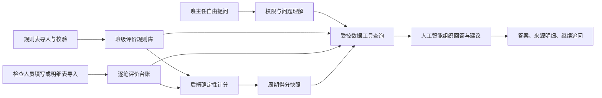

# PRD-班主任助理 V2：班级评价自由对话

> **历史方案，已停止使用。** 当前 V2 需求以 `docs/PRD-班主任助理V2-班级周评分析Agent.md` 为准。本文件中的自由对话、责任划分和整改状态不属于当前产品范围。

> 版本：V1.0
> 更新日期：2026-08-07
> 适用端：教师手机端
> 当前阶段：客户方案确认 + Demo 验证
> 附件依据：`/Users/mayday/Downloads/班级评价表 汇总7.24日.xlsx`、`IMG_1396.PNG`、`IMG_1397.PNG`

## 1. 摘要

班主任助理 V2 面向只开展“班级评价”、没有学生个人评价数据的学校。它把学校线下班级评分明细转成可查询的班级评价台账，班主任可以用自然语言询问本班得分、扣分原因、检查规则、责任归属和整改建议，并基于上一轮答案继续追问。

V2 与现有班主任助理并行存在。现有版本分析学生详细评价记录，V2 只分析班级评价规则、扣分记录和得分快照。学校后台通过能力权限决定展示哪个入口，也可以在试点期间同时展示两个入口。

## 2. 联系人

| 角色 | 负责人 | 职责 |
|---|---|---|
| 产品负责人 | 待补充 | 确认客户口径、首版范围和验收结果 |
| 学校德育负责人 | 待补充 | 确认评价规则、责任划分和公示范围 |
| 班主任代表 | 待补充 | 验证问题是否能被快速回答 |
| 数据实施 | 待补充 | 完成规则导入、明细映射和历史数据校验 |
| 教师端研发 | 待补充 | 完成入口、对话、证据明细和异常状态 |
| 后端研发 | 待补充 | 完成权限、台账、得分计算、会话和审计 |
| 人工智能服务 | 待补充 | 完成意图识别、工具调用、回答生成和安全控制 |
| 测试负责人 | 待补充 | 验证得分一致性、追问、权限和异常场景 |

## 3. 背景

### 3.1 客户现状

学校线下按照班级评价表对每个班级进行检查和扣分。班主任最终只能看到一个得分结果，无法及时知道：

1. 哪一天、哪个检查项目被扣分。
2. 具体观察到什么问题。
3. 扣分依据是哪一条规则。
4. 扣分属于班级行为责任，还是当堂教师、值岗教师的组织责任。
5. 同类问题是否重复发生。
6. 下一步应该先改什么、由谁处理、如何确认已经改善。

学校没有精力人工整理并逐班公示扣分明细，因此最终分数与过程事实脱节。班主任看见结果，却无法采取行动。

### 3.2 附件分析

附件中的评价表是一个 100 分制班级评价规则表，共有 5 个一级维度，每个维度 20 分：

| 一级维度 | 主要内容 |
|---|---|
| 诗意中队 | 少先队礼仪、中队文化建设、队会课 |
| 安全教育 | 公共秩序、违禁品、安全班会、安全记录和学伤事故 |
| 健体班级 | 早操体锻、眼保健操、教师组织管理 |
| 文雅班级 | 班级文化、班级内务、路队放学、协调精灵到岗 |
| 美净班级 | 晨检、午检、班级保洁 |

表内约有 29 个三级检查项。规则不是简单的“每项扣 1 分”，而是同时存在：

- 按学生人次扣分，例如每人次扣 0.1 或 0.5 分。
- 按问题数量扣分，例如每发现一处扣 0.1 分。
- 按人数区间扣分，例如 5 人以内扣 0.5 分、6 至 10 人扣 1 分。
- 按严重程度区间扣分，例如扣 0.5 至 2 分。
- 分值扣完为止，不允许无限扣减。
- 年级豁免，例如一年级暂不检查部分少先队项目。
- 条件例外，例如无漂流书栈的班级使用另一套计分规则。
- 一票否决，例如校园欺凌或反馈表遗失可能影响整周评比。
- 班级与责任教师分摊，例如眼操、清洁评分按班级与教师各占 50%。
- 固定或不定期检查，例如每日、每周、每月、每周 1 至 3 次。

两张截图展示了学校当前熟悉的云文档、问卷模板和上传文件操作。它们不包含扣分事实，但说明首期可以采用“上传现有表格 + 模板化采集表”的过渡方式，不必要求学校一次性改变全部工作习惯。

工作簿中实际存在 3 个工作表，导入前需要处理版本歧义：

- `诗意中队`：完整的 100 分班级评价表，是当前最接近正式版本的候选规则源。
- `Sheet2`：仅包含安全教育部分，部分口径与主表不同。例如安全班会未召开在主表中扣 1 分、在该表中扣 0.5 分；危险物品和安全活动的扣分范围也不一致。
- `Sheet3`：空白工作表，不应导入。

系统不能自动把 `Sheet2` 与主表合并。上线前必须由学校确认权威工作表、规则版本、生效日期及旧规则适用的历史周期；未确认的冲突规则进入“待校验”状态，不参与计分和人工智能回答。

### 3.3 最关键的数据结论

当前附件只有“评价规则”，没有“每一次扣分事实”。只有最终分数和规则表时，任何系统都无法可靠回答“具体为什么扣分”。

因此 V2 的建设前提不是先做聊天框，而是先形成逐笔班级评价台账。每次扣分至少要保存时间、班级、评价项、观察事实、扣分值、评价人和责任归属。人工智能只能查询这些事实，不能根据最终分数反推或编造原因。

## 4. 目标

### 4.1 产品目标

1. 班主任在 30 秒内知道本班本周主要扣分原因。
2. 每一项扣分回答都能追溯到原始记录和当时生效的规则版本。
3. 支持自然语言自由提问，并能基于上一轮上下文继续追问。
4. 明确区分班级行为责任、教师组织责任和共同责任。
5. 把扣分事实转成少量、具体、可执行的整改建议。
6. 不改变现有班主任助理的数据来源和使用逻辑。

### 4.2 关键结果

| 关键结果 | 首版目标 |
|---|---:|
| 有明细的问题回答可追溯率 | 100% |
| 得分与评价台账汇总一致率 | 100% |
| 首次回答时间 | 5 秒内 |
| 班主任找到某笔扣分明细所需操作 | 不超过 3 次 |
| 无数据时编造扣分原因比例 | 0% |
| 回答中班级责任与教师责任混淆比例 | 0% |
| 建议数量 | 每次不超过 3 条 |
| 追问上下文命中率 | 试点期不低于 90% |

## 5. 市场与用户

### 5.1 核心用户

- 班主任：查看本人带班班级的评价得分、扣分明细和整改建议。
- 已授权副班主任：与班主任共享同一班级数据。
- 学校德育管理者：配置评价规则、导入或采集评价明细、处理更正和申诉。
- 检查人员：按模板提交结构化班级评价记录。

### 5.2 适用学校

- 以班级为评价主体，没有学生个人评价明细。
- 已有班级评分表、文明班级或流动红旗评比。
- 当前通过纸张、Excel 或云表格采集，公示成本高。

### 5.3 不在首版范围

- 从最终得分自动反推不存在的扣分明细。
- 识别或评价具体学生。
- 让人工智能直接修改得分、删除记录或判定申诉结果。
- 跨班级查看未授权数据。
- 用聊天回答替代正式申诉和更正流程。
- 让人工智能自行解释模糊规则并决定扣分值。

## 6. 价值主张

### 6.1 对班主任

- 不用等待人工公示，直接知道分数由哪些记录构成。
- 可以继续追问时间、规则、责任人和同类历史。
- 能把“扣了多少”转成“下一步先做什么”。
- 对存在异议的记录，能准确定位编号和依据。

### 6.2 对学校

- 减少逐班整理、公示和重复解释的工作。
- 每一笔分数都有完整审计链，降低口径争议。
- 通过责任归属和整改状态形成管理闭环。
- 保留现有评价体系，不要求学校改用学生评价。

### 6.3 与现有班主任助理的区别

| 项目 | 现有班主任助理 | 班主任助理 V2 |
|---|---|---|
| 评价主体 | 学生、学生群体 | 班级 |
| 数据来源 | 学生评价详细记录 | 班级评分规则、扣分台账、得分快照 |
| 主要形态 | 周建议、月复盘 | 自由对话、证据查询、连续追问 |
| 核心问题 | 学生和班级出现了什么信号 | 本班为什么扣分、规则是什么、怎么改 |
| 历史对象 | 周报、月报 | 会话和扣分事实 |
| 是否共用模型输入 | 否 | 否 |

## 7. 解决方案

### 7.1 总体流程



### 7.2 可采集信息

#### 7.2.1 评价规则层

每一条三级评价规则建议采集：

| 字段 | 用途 |
|---|---|
| `school_id` | 学校隔离 |
| `rubric_id`、`rubric_version` | 保存规则版本，历史记录不随新规则改变 |
| `level_1/2/3_id`、`name` | 一级、二级、三级指标路径 |
| `full_score` | 本项满分 |
| `standard_text` | 完整评价内容及标准 |
| `deduction_mode` | 按人次、按问题、按区间、固定值、严重程度 |
| `deduction_step/range` | 每次扣多少或允许区间 |
| `deduction_cap` | 本项最多扣多少 |
| `check_frequency` | 每日、每周、每月或不定期 |
| `check_time` | 早读、中午、课间、放学等 |
| `evaluator_role` | 德育处、体育教师、健康室、学生评分精灵等 |
| `responsibility_rule` | 班级、教师、共同责任及分摊比例 |
| `applicable_grades` | 适用年级 |
| `exception_rule` | 一年级豁免、无漂流书栈等例外 |
| `veto_rule` | 一票否决条件 |
| `effective_from/to` | 规则生效时间 |
| `source_reference` | 附件、工作表和行号 |

#### 7.2.2 逐笔评价事实层

每一次检查或扣分建议采集：

| 字段 | 用途 |
|---|---|
| `record_id` | 唯一记录编号 |
| `school_id/class_id` | 学校和班级 |
| `occurred_at` | 问题实际发生时间 |
| `recorded_at` | 记录提交时间 |
| `period_id` | 所属周、月或评比周期 |
| `rubric_id/version/rule_id` | 当时使用的规则 |
| `indicator_path` | 完整指标路径 |
| `observation` | 观察到的客观事实 |
| `quantity`、`quantity_unit` | 人数、次数、问题数等计分输入 |
| `severity` | 严重程度，仅在规则允许时使用 |
| `raw_deduction` | 本次规则扣分总值 |
| `class_deduction` | 计入班级责任的扣分 |
| `teacher_deduction` | 计入责任教师组织责任的扣分 |
| `responsibility_type` | 班级、教师、共同责任 |
| `responsible_role/name` | 班主任、任课教师、值岗教师等；按权限展示姓名 |
| `evaluator_role/name` | 谁检查、谁提交 |
| `location` | 教室、操场、楼道等 |
| `evidence` | 图片、附件或文字依据；首版允许只有文字 |
| `notification_status` | 是否已通知班主任 |
| `rectification_status/note` | 待整改、已整改、已复核 |
| `appeal_status` | 无异议、待处理、已更正、已驳回 |
| `source_type/source_id` | 手机表单、Excel 导入或第三方云表格 |

#### 7.2.3 周期得分快照层

- 评价周期。
- 期初满分。
- 各级指标累计扣分。
- 班级责任扣分、教师组织责任扣分。
- 一票否决状态。
- 最终得分。
- 快照生成时间和数据水位线。
- 规则版本和记录编号集合。

### 7.3 数据采集方案

#### 7.3.1 第一阶段：兼容现有工作方式

1. 管理员上传现有评价规则表，实施人员确认层级、分值和特殊规则。
2. 若同一附件存在多工作表或相同指标的不同扣分口径，先生成规则冲突清单，由学校指定权威版本和生效日期。
3. 学校继续使用现有 Excel 或云表格，但明细模板必须做到“一行一笔评价事实”。
4. 系统按日或按周导入明细，并给出班级、规则、扣分值和总分校验结果。
5. 只有最终分数、没有明细的周期明确标记为“缺少原因明细”，聊天不得编造解释。

#### 7.3.2 第二阶段：结构化移动采集

为检查人员提供模板化表单：

1. 选择班级。
2. 选择评价项。
3. 填写人数、次数或问题数量。
4. 系统按规则计算建议扣分，检查人确认后提交。
5. 填写客观事实，可选上传图片。
6. 根据规则自动拆分班级责任与教师组织责任。
7. 写入台账并更新得分快照。

低频字段如规则说明、例外、责任分摊通过底部抽屉按需查看，不堆叠在采集首页。

#### 7.3.3 导入质量校验

- 班级必须能映射到系统班级编号。
- 评价项必须匹配当期规则版本。
- 扣分不得超过规则上限。
- 分摊后的班级扣分与教师扣分之和必须等于本次总扣分。
- 一票否决必须人工复核，不能由人工智能触发。
- 重复导入使用来源编号去重。
- 最终得分必须能由逐笔台账重新计算。

### 7.4 教师手机端页面

#### 7.4.1 入口

位置：`我的 → 管理工具 → 班主任助理 V2`。

- 复用现有班主任助理图标和人工智能角标。
- 现有“班主任助理”和“班主任助理 V2”同时保留。
- 后台向教师空间返回 `enabled_management_tools`，前端只渲染授权入口。
- 新客户正式上线时建议只展示 V2，避免老师理解成本。

#### 7.4.2 对话页

页面保持高信息密度，不使用大幅助理形象：

1. 标题栏展示“班主任助理 V2”，右侧避让微信胶囊。
2. 标题下方展示当前班级与评价周期，点击班级可切换已授权班级。
3. 首条助理消息直接给出当前得分、扣分笔数和主要集中项。
4. 提供 3 个与当前数据相关的建议问题。
5. 用户消息右对齐，助理消息左对齐。
6. 数据摘要在消息内使用紧凑数值和列表，不使用多层卡片。
7. 原始扣分事实通过“查看扣分明细”底部抽屉渐进披露。
8. 底部固定输入区支持自由文字，发送按钮只在有内容时可用。
9. 回答生成中显示简洁状态，不伪造精确进度。

#### 7.4.3 支持的问题

- “本周为什么扣分？”
- “7 月 18 日有哪些扣分？”
- “早操具体扣在哪里？”
- “这些扣分分别是谁的责任？”
- “眼保健操的扣分规则是什么？”
- “和上周相比哪里变差了？”
- “最应该先改哪三件事？”
- “刚才说的早操问题具体怎么改？”
- “这条记录是谁检查的？”
- “我对这笔扣分有异议，依据是什么？”

### 7.5 连续追问规则

会话只保留必要的结构化上下文：

- 当前学校和班级。
- 当前时间范围。
- 上一轮聚焦的指标。
- 上一轮引用的记录编号。
- 上一轮责任类型。

“这些、刚才那条、怎么改”等追问优先继承上一轮上下文。切换班级后立即清空原班级上下文，防止串班。时间或对象无法确定时，只问一个最小澄清问题，不连续追问多个条件。

### 7.6 回答结构

一次回答最多包含：

1. 一句直接结论。
2. 不超过 5 项的扣分汇总或明细。
3. 必要的班级责任与教师责任说明。
4. 不超过 3 条整改建议。
5. 数据来源与明细入口。
6. 2 至 3 个继续追问建议。

回答不得只说“建议加强管理”。建议必须包含动作、责任角色和验证方式，例如：

> 明天早操下楼前，由体育委员按“快、齐、静”检查一次队列；班主任只需在楼层出口确认。连续 3 天没有出现 6 人以上说话或掉队，可视为本项改善。

### 7.7 技术实现

#### 7.7.1 服务划分

- 规则服务：管理评价体系、版本、例外和责任分摊。
- 评价台账服务：保存逐笔事实、证据、整改和申诉状态。
- 计分服务：根据规则确定性计算，不调用大模型。
- 权限服务：校验教师空间、带班关系、入口能力和字段可见范围。
- 会话服务：保存消息、结构化上下文和证据引用。
- 人工智能编排服务：理解问题、选择数据工具、生成回答。

#### 7.7.2 受控数据工具

人工智能不得直接访问数据库，只能调用：

- `get_class_score_summary(class_id, period)`：查询得分和维度汇总。
- `search_class_evaluation_records(class_id, period, filters)`：查询逐笔评价事实。
- `get_class_evaluation_record(record_id)`：查询单笔完整明细。
- `get_evaluation_rule(rule_id, version)`：查询当时生效规则。
- `get_class_score_comparison(class_id, current_period, comparison_period)`：查询周期对比。
- `get_rectification_status(record_ids)`：查询整改状态。

工具层每次调用都重新校验学校、班级和教师权限。返回内容带数据快照编号，前端只展示被引用且仍有权限的记录。

#### 7.7.3 请求流程

1. 前端提交 `conversation_id`、`class_id` 和用户消息。
2. 服务端校验 V2 能力权限和带班权限。
3. 解析意图、时间范围、指标和上下文引用。
4. 调用一个或多个受控数据工具。
5. 后端完成分值汇总和规则计算。
6. 人工智能只根据工具结果生成结构化回答。
7. 服务端校验回答引用的记录编号是否真实存在。
8. 前端渲染文字、数据摘要、明细入口和追问建议。
9. 保存消息、工具调用摘要和审计信息。

#### 7.7.4 接口建议

`POST /teacher-assistant-v2/conversations/{conversation_id}/messages`

请求：

```json
{
  "class_id": "c_2025_4",
  "message": "早操具体扣在哪里？",
  "client_message_id": "uuid"
}
```

响应：

```json
{
  "message_id": "msg_001",
  "answer_type": "deduction_detail",
  "message": "早操共扣1.5分，主要来自精神风貌和教师组织管理。",
  "context": {
    "period": "2026-07-14/2026-07-20",
    "indicator_ids": ["fitness-morning-exercise"],
    "record_ids": ["ce_001", "ce_008"]
  },
  "breakdown": [],
  "actions": [],
  "evidence_refs": ["ce_001", "ce_008"],
  "follow_up_suggestions": ["分别是谁的责任？", "早操应该怎么改？"]
}
```

### 7.8 人工智能安全与可信规则

- 分数、条数、比例和责任分摊必须来自工具结果。
- 没有逐笔明细时明确说明“当前只有最终得分，尚未同步原因明细”。
- 不把班级扣分归因到具体学生。
- 不使用“差班、纪律差、班主任不负责”等标签。
- 教师组织责任只能按规则和记录表达，不能推断教师能力或态度。
- 建议只针对可观察流程，不进行心理、人格或家庭归因。
- 回答中涉及姓名时遵循学校字段权限；默认只显示角色。
- 人工智能不能修改扣分、处理申诉或触发一票否决。
- 所有回答显示“内容由人工智能基于班级评价台账生成”。

### 7.9 权限配置

学校空间返回明确的管理工具权限：

```json
{
  "enabled_management_tools": ["headteacherAssistantV2"]
}
```

支持三种配置：

- 旧学校：只返回 `headteacherAssistant`。
- 新学校：只返回 `headteacherAssistantV2`。
- 试点或演示学校：同时返回两个能力。

V2 内部还需要校验：

- 只能查看本人担任班主任或已授权副班主任的班级。
- 班级关系变化后立即失去访问权限。
- 检查人姓名、责任教师姓名和证据图片可分别配置可见范围。
- 分享、导出和截图水印由学校策略决定，首版不提供公开链接。

### 7.10 异常与边界

| 场景 | 处理 |
|---|---|
| 只有最终分数，没有明细 | 说明无法解释原因，展示最近同步时间，不猜测 |
| 规则存在，记录未匹配规则 | 标记“待数据管理员校验”，不计入人工智能结论 |
| 得分快照与台账不一致 | 以计分服务复算结果为校验异常，不让模型解释差额 |
| 用户问其他班级 | 权限拒绝，不透露班级是否存在 |
| 时间范围不明确 | 继承当前周期；仍不明确时只问一个澄清问题 |
| 一票否决 | 展示已复核状态和依据，不由模型自行判定 |
| 用户要求修改扣分 | 引导进入正式更正或申诉流程 |
| 对话中切换班级 | 清空原班级上下文并创建新会话上下文 |
| 网络中断 | 保留未发送内容；重进后恢复会话 |
| 人工智能服务失败 | 允许直接查看结构化扣分明细，不阻断数据查询 |

### 7.11 Demo 范围

本次 Demo 实现：

- “班主任助理 V2”入口，复用原班主任助理图标。
- 后台能力列表的前端模拟配置。
- 2025级四班一周 100 分制模拟台账。
- 当前得分、维度扣分、逐笔明细和责任拆分。
- 自由文字输入与关键词意图模拟。
- 建议问题、连续追问和上下文继承。
- 扣分明细底部抽屉。
- 班级切换和对话上下文重置。

本次 Demo 不调用真实人工智能，也不上传真实学校数据。

### 7.12 验收标准

#### 功能

- 现有班主任助理入口保持可用。
- V2 使用同一图标，标题明确区分。
- 权限配置可以只显示 V1、只显示 V2 或同时显示。
- 输入“本周为什么扣分”能返回得分、累计扣分和主要维度。
- 输入“早操具体扣在哪里”能返回早操相关事实。
- 接着输入“怎么改”能继承早操上下文。
- 输入“哪些属于教师组织责任”能区分责任扣分。
- 每条回答引用的明细编号都能在底部抽屉中查看。
- 切换班级后不沿用原班级上下文。

#### 数据

- 最终得分等于满分减逐笔扣分。
- 班级扣分与教师扣分之和等于记录总扣分。
- 历史记录保存当时规则版本。
- 无明细时不生成具体原因。

#### 体验

- 输入框、发送按钮、班级切换和明细按钮触控区域不小于 44 像素。
- 页面首屏可以看到当前班级、当前得分、建议问题和输入框。
- 明细通过底部抽屉展示，不在聊天正文堆叠长规则。
- 生成中、失败、无数据和无权限状态有明确反馈。
- 人工智能内容有清晰来源提示。

## 8. 发布

### 阶段一：客户确认与 Demo

- 完成规则附件结构化分析。
- 完成 V2 入口和自由对话 Demo。
- 用模拟台账验证高频问题和追问路径。
- 与学校确认责任分摊、评价周期、明细可见范围和申诉流程。
- 与学校确认主工作表、冲突规则、生效日期及历史版本适用范围。

### 阶段二：数据接入

- 导入正式评价规则并完成版本校验。
- 确定现有明细表的“一行一笔”模板。
- 接入班级、教师、带班关系和 V2 权限。
- 上线规则、台账、计分和查询接口。
- 完成得分复算与历史数据对账。

### 阶段三：真实对话试点

- 接入受控工具调用和正式系统提示词。
- 开放少量班主任试用。
- 监控无答案率、追问命中率、错误引用和责任混淆。
- 根据真实提问补充时间、指标和责任意图。

### 阶段四：管理闭环

- 整改状态、复核和申诉入口。
- 周期对比和重复问题识别。
- 对话历史和学校级运营分析。
- 与检查人员移动采集表单打通。
